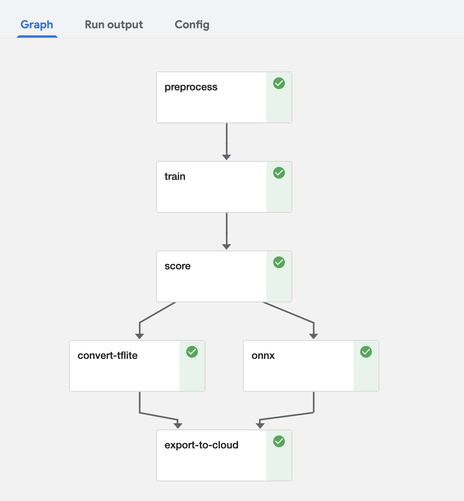

## Game of Thrones Image Classification Demo

This is demo code for my talk at [Open Source Summit NA 2019](https://ossna19.sched.com/event/PUTJ).

"Machine Learning Made Easy on Kubernetes. DevOps for Data Scientists," August 21, 2019

[-> Slides here <-](./ml-slides.pdf)

### Game of Thrones Characters

* Robert Baratheon (robert-baratheon)
* Tyrion Lannister (tyrion-lannister)
* Jon Snow (jon-snow)
* Daenerys Targaryen (daenerys-targaryen)
* Hodor (hodor)
* Samwell Tarley (samwell-tarley)
* Cersei Lannister (cersei-lannister)
* Theon Greyjoy (theon-greyjoy)
* Night King (night-king)
* Arya Stark (arya-stark)
* Benjen Stark (benjen-stark)
* Jamie Lannister (jamie-lannister)
* Margaery Tyrell (margaery-tyrell)
* Sansa Stark (sansa-stark)

### Local testing/training

* Testing in local Docker container interactively

  ```bash
  docker run -it --rm --name got \
    --publish 6006:6006 \
    --publish 5000:5000 \
    --volume /Users/brianredmond/gopath/src/github.com/chzbrgr71/got-image-classification:/got-image-classification \
    --workdir /got-image-classification \
  tensorflow/tensorflow:1.13.1

  python ./training/retrain.py \
    --bottleneck_dir=/got-image-classification/tf-output/bottlenecks \
    --model_dir=/tmp/tensorflow/inception \
    --summaries_dir=/got-image-classification/tf-output \
    --output_graph=/got-image-classification/tf-output \
    --output_labels=/got-image-classification/tf-output \
    --image_dir=/got-image-classification/training/images \
    --saved_model_dir=/got-image-classification/tf-output \
    --how_many_training_steps 2000

  python ./preprocess/processimages.py \
    --bottleneck_dir=/got-image-classification/tf-output/bottlenecks \
    --image_dir=/got-image-classification/preprocess/images 

  # or conda
  source activate tf

  python ./training/retrain.py \
    --bottleneck_dir=./tf-output/bottlenecks \
    --model_dir=./tf-output/inception \
    --summaries_dir=./tf-output \
    --output_graph=./tf-output \
    --output_labels=./tf-output \
    --image_dir=./training/images \
    --saved_model_dir=./tf-output \
    --how_many_training_steps 2000  

  tensorboard --logdir=/got-image-classification/tf-output/training_summaries
  ```

* Create preprocess container image

  ```bash
  # set image tag depending on target cpu/gpu
  export IMAGE_TAG=2.00
  export ACRNAME=gotcr

  # build/push (ACR or Docker)
  az acr build -t chzbrgr71/got-image-preprocess:$IMAGE_TAG -r $ACRNAME ./preprocess

  docker build -t chzbrgr71/got-image-preprocess:$IMAGE_TAG -f ./preprocess/Dockerfile ./preprocess
  docker push chzbrgr71/got-image-preprocess:$IMAGE_TAG
  ```

* Create training container image

  ```bash
  # set image tag depending on target cpu/gpu
  export IMAGE_TAG=2.0
  export IMAGE_TAG=2.00-gpu
  export ACRNAME=gotcr

  # build/push (ACR or Docker)
  az acr build -t chzbrgr71/got-image-training:$IMAGE_TAG -r $ACRNAME ./training

  docker build -t chzbrgr71/got-image-training:$IMAGE_TAG -f ./training/Dockerfile ./training
  docker push chzbrgr71/got-image-training:$IMAGE_TAG
  ```

* Create scoring container image

  ```bash
  # set image tag depending on target cpu/gpu
  export IMAGE_TAG=2.01
  export ACRNAME=gotcr

  # build/push (ACR or Docker)
  az acr build -t chzbrgr71/got-model-scoring:$IMAGE_TAG -r $ACRNAME ./serving

  docker build -t chzbrgr71/got-model-scoring:$IMAGE_TAG -f ./serving/Dockerfile ./serving
  docker push chzbrgr71/got-model-scoring:$IMAGE_TAG

  docker run -d --name score --volume /Users/brianredmond/gopath/src/github.com/chzbrgr71/got-image-classification:/got-image-classification chzbrgr71/got-model-scoring:$IMAGE_TAG '/got-image-classification/tf-output/latest_model'
  ```

* Test local

  ```bash
  docker run -d --name process --volume /Users/brianredmond/gopath/src/github.com/chzbrgr71/got-image-classification:/got-image-classification chzbrgr71/got-image-preprocess:$IMAGE_TAG "--bottleneck_dir=/got-image-classification/tf-output/bottlenecks" "--image_dir=/got-image-classification/preprocess/images"
  ```

  ```bash
  docker run -d --name train --volume /Users/brianredmond/gopath/src/github.com/chzbrgr71/got-image-classification:/got-image-classification chzbrgr71/got-image-training:$IMAGE_TAG "--bottleneck_dir=/tmp/tensorflow/bottlenecks" "--model_dir=/tmp/tensorflow/inception" "--summaries_dir=/got-image-classification/tf-output/training_summaries/baseline" "--output_graph=/got-image-classification/tf-output/retrained_graph.pb" "--output_labels=/got-image-classification/tf-output/retrained_labels.txt" "--image_dir=/images" "--saved_model_dir=/got-image-classification/tf-output/saved_models/1"
  ```

* Tensorboard local
  ```bash
  export IMAGE_TAG=2.00
  export ACRNAME=gotcr

  # build/push (ACR or Docker)
  az acr build -t chzbrgr71/tensorboard:$IMAGE_TAG -r $ACRNAME -f ./tensorboard/Dockerfile ./tensorboard

  docker build -t chzbrgr71/tensorboard:$IMAGE_TAG -f ./tensorboard/Dockerfile ./tensorboard
  docker push chzbrgr71/tensorboard:$IMAGE_TAG

  # run
  docker run -d --name tb -p 6006:6006 --volume /Users/brianredmond/gopath/src/github.com/chzbrgr71/got-image-classification/tf-output:/tf-output chzbrgr71/tensorboard:$IMAGE_TAG "--logdir" "/tf-output/training_summaries"
  ```

### Kubernetes Setup

* Create Azure Kubernetes Service

  * Use node pools to add GPU nodes. https://docs.microsoft.com/en-us/azure/aks/use-multiple-node-pools 

  * Add Virtual Node add-on

    ```bash
    export VK_RELEASE=virtual-kubelet-latest
    export CHART_URL=https://github.com/virtual-kubelet/virtual-kubelet/raw/master/charts/$VK_RELEASE.tgz
    helm install --name vk "$CHART_URL" --namespace kube-system -f ./k8s/vk-helm-values.yaml
    ```

  * Enable GPU's with daemonset. https://docs.microsoft.com/en-us/azure/aks/gpu-cluster 

    ```bash
    kubectl create namespace gpu-resources
    kubectl apply -f ./k8s/nvidia-device-plugin-ds.yaml
    ```

* Storage (Azure Files Static)

    > Azure Files Docs: https://docs.microsoft.com/en-us/azure/aks/azure-files-volume 

    ```bash
    export AKS_PERS_STORAGE_ACCOUNT_NAME=briarmlwestnew
    export AKS_PERS_RESOURCE_GROUP=oss-summit-west-new
    export AKS_PERS_LOCATION=westus
    export AKS_PERS_SHARE_NAME=aksshare

    # Create the storage account
    az storage account create -n $AKS_PERS_STORAGE_ACCOUNT_NAME -g $AKS_PERS_RESOURCE_GROUP -l $AKS_PERS_LOCATION --sku Standard_LRS

    # Export the connection string as an environment variable, this is used when creating the Azure file share
    export AZURE_STORAGE_CONNECTION_STRING=`az storage account show-connection-string -n $AKS_PERS_STORAGE_ACCOUNT_NAME -g $AKS_PERS_RESOURCE_GROUP -o tsv`

    # Create the file share
    az storage share create -n $AKS_PERS_SHARE_NAME

    # Get storage account key
    STORAGE_KEY=$(az storage account keys list --resource-group $AKS_PERS_RESOURCE_GROUP --account-name $AKS_PERS_STORAGE_ACCOUNT_NAME --query "[0].value" -o tsv)

    # Echo storage account name and key
    echo Storage account name: $AKS_PERS_STORAGE_ACCOUNT_NAME
    echo Storage account key: $STORAGE_KEY

    kubectl create secret generic azure-file-secret --from-literal=azurestorageaccountname=$AKS_PERS_STORAGE_ACCOUNT_NAME --from-literal=azurestorageaccountkey=$STORAGE_KEY

    kubectl create secret generic azure-file-secret --from-literal=azurestorageaccountname=$AKS_PERS_STORAGE_ACCOUNT_NAME --from-literal=azurestorageaccountkey=$STORAGE_KEY --namespace kubeflow

    # Add persistent volume
    kubectl apply -f ./k8s/persistent-volume.yaml
    ```

### Kubernetes Jobs

* Kubernetes job

  ```bash
  kubectl apply -f ./k8s/job-preprocess.yaml

  kubectl apply -f ./k8s/job-training.yaml

  kubectl apply -f ./k8s/tensorboard.yaml
  ```

### Kubeflow

* Install Kubeflow (I am using v0.5.0) https://www.kubeflow.org/docs/started/getting-started-k8s 

  ```bash
  export KFAPP=kf-app-got-3
  kfctl init ${KFAPP}
  cd ${KFAPP}
  kfctl generate all -V
  kfctl apply all -V
  ```

* Validate Kubeflow

  ```bash
  kubectl -n kubeflow get all
  ```

* Execute TFJob

  ```bash
  # cpu
  kubectl apply -f ./k8s/tfjob-training.yaml

  # gpu
  kubectl apply -f ./k8s/tfjob-training-gpu.yaml

  # aci
  kubectl apply -f ./k8s/tfjob-training-vk.yaml

  # Azure Premium Files
  kubectl apply -f ./k8s/tfjob-training-prem.yaml
  ```

* Deploy Serving 

  ```bash
  kubectl apply -f ./k8s/serving.yaml
  ```

  ```bash
  docker cp tf-output/latest_model/exported_model serving_base:/models/inception

  docker commit --change "ENV MODEL_NAME inception" serving_base chzbrgr71/got-tfserving:1.0
  ```

* Deploy Tensorboard

  ```bash
  kubectl apply -f ./k8s/tensorboard.yaml
  ```

* Kubeflow Pipelines

  * Create a clean Python 3 environment

    ```bash
    conda create --name mlpipeline python=3.7
    source activate mlpipeline
    pip install -r ./pipelines/requirements.txt --upgrade
    ```

  * Compile pipeline

    ```bash
    source activate mlpipeline
    python3 ./pipelines/pipeline.py
    ```
  
  * For now, there are a couple manual edits needed on the pipeline.yaml
    * environment variables (KUBE_POD_NAME in training)
    * volumes for Azure files

    


### Jupyter Notebooks

  * Via port-forward to notebook instance

    ```bash
    kubectl port-forward brian-testing-01-0 -n kubeflow 8888:8888
    ```

    http://localhost:8888/notebook/kubeflow/brian-testing-01

  * Access via Traefik ingress. http://jupyter.brianredmond.io/notebook/kubeflow/brian-testing-01 

### Hyperparameter Optimization

  * Using Helm chart and AKS Virtual Nodes with GPU:

    ```bash
    helm install --name hyperparam ./hyperparameter/chart

    kubectl apply -f ./hyperparameter/tensorboard-hp.yaml
    ```

  * katib

    ```bash
    kubectl apply -f ./katib/random-example.yaml
    
    kubectl apply -f ./katib/got.yaml
    ```

### Inference

* Local python script

  ```bash
  # testing
  python ./serving/label-image.py ./serving/benjen.jpg

  hodor (score = 0.35062)
  benjen stark (score = 0.21019)
  samwell tarley (score = 0.13798)
  jon snow (score = 0.10155)
  robert baratheon (score = 0.04643)
  theon greyjoy (score = 0.04288)
  daenerys targaryen (score = 0.03613)
  tyrion lannister (score = 0.02663)
  night king (score = 0.02428)
  margaery tyrell (score = 0.00809)
  cersei lannister (score = 0.00707)
  arya stark (score = 0.00544)
  sansa stark (score = 0.00271)
  ```

* TF Serving (Local)

  ```bash
  docker run -d --name serving \
    --publish 8500:8500 \
    --volume /Users/brianredmond/gopath/src/github.com/chzbrgr71/got-image-classification/tf-output/saved_models:/models/inception \
    --env MODEL_NAME=inception \
  tensorflow/serving:1.13.0
  ```

  ```bash
  python serving/inception_client.py --server localhost:8500 --image ./serving/hodor.jpg
  python serving/inception_client.py --server localhost:8500 --image ./serving/tyrion.jpg
  python serving/inception_client.py --server localhost:8500 --image ./serving/night-king.jpg
  ```

* TF Serving (AKS)

  ```bash
  kubectl apply -f ./k8s/serving.yaml

  python serving/inception_client.py --server 104.45.210.253:8500 --image ./serving/night-king.jpg
  python serving/inception_client.py --server gotserving.brianredmond.io:8500 --image ./serving/jon-snow.jpg
  python serving/inception_client.py --server gotserving.brianredmond.io:8500 --image ./serving/benjen.jpg
  ```

  ```bash
  # serving api metadata
  curl http://gotserving.eastus.azurecontainer.io:8501/v1/models/inception/versions/1/metadata
  
  # convert image to base64: https://onlinepngtools.com/convert-png-to-base64

  curl -X POST http://gotserving.eastus.azurecontainer.io:8501/v1/models/inception:predict -d "@./serving/daenerys-targaryen.json"
  curl -X POST http://gotserving.brianredmond.io:8501/v1/models/inception:predict -d "@./serving/daenerys-targaryen.json"
  curl -X POST http://104.45.210.253:8501/v1/models/inception:predict -d "@./serving/daenerys-targaryen.json"
  ```

  * Web App

    ```bash
    export IMAGE_TAG=2.01
    export ACRNAME=gotcr

    # build/push (ACR or Docker)
    az acr build -t chzbrgr71/got-web-app:$IMAGE_TAG -r $ACRNAME ./webapp

    docker build -t chzbrgr71/got-web-app:$IMAGE_TAG -f ./webapp/Dockerfile ./webapp
    docker push chzbrgr71/got-web-app:$IMAGE_TAG

    docker run -d --name web -p 3000:3000 -e ML_SERVING_ENDPOINT=http://gotserving.brianredmond.io:8501/v1/models/inception:predict chzbrgr71/got-web-app:$IMAGE_TAG

    kubectl apply -f ./k8s/web.yaml

    az webapp config appsettings set --name got-web -g game-of-thrones --settings ML_SERVING_ENDPOINT='http://gotserving.brianredmond.io:8501/v1/models/inception:predict'
    ```

### Tensorflow Lite

* Convert model

  ```bash
  IMAGE_SIZE=299
  tflite_convert \
    --graph_def_file=./tf-output/latest_model/got_retrained_graph.pb \
    --output_file=./tf-output/latest_model/optimized_graph.lite \
    --input_format=TENSORFLOW_GRAPHDEF \
    --output_format=TFLITE \
    --input_shape=1,${IMAGE_SIZE},${IMAGE_SIZE},3 \
    --input_array=Mul \
    --output_array=final_result \
    --inference_type=FLOAT \
    --input_data_type=FLOAT
  ```

* In container

  ```bash
  export IMAGE_TAG=2.00
  export ACRNAME=gotcr

  # build/push (ACR or Docker)
  az acr build -t chzbrgr71/tflite-convert:$IMAGE_TAG -r $ACRNAME -f ./convert/Dockerfile ./convert

  docker build -t chzbrgr71/tflite-convert:$IMAGE_TAG -f ./convert/Dockerfile ./convert
  docker push chzbrgr71/tflite-convert:$IMAGE_TAG

  # run
  docker run -d --name convert --volume /Users/brianredmond/gopath/src/github.com/chzbrgr71/got-image-classification/tf-output:/tf-output chzbrgr71/tflite-convert:$IMAGE_TAG \
    --graph_def_file=./tf-output/latest_model/got_retrained_graph.pb \
    --output_file=./tf-output/latest_model/optimized_graph.lite \
    --input_format=TENSORFLOW_GRAPHDEF \
    --output_format=TFLITE \
    --input_shape=1,299,299,3 \
    --input_array=Mul \
    --output_array=final_result \
    --inference_type=FLOAT \
    --input_data_type=FLOAT
  ```

  ```bash
  kubectl apply -f ./k8s/convert.yaml
  ```

### ONNX

* This doesn't work at all: 
  
  ```bash
  source activate mlpipeline

  python -m tf2onnx.convert \
    --saved-model ./tf-output/latest_model/exported_model/1/ \
    --output ./tf-output/onnx/model.onnx \
    --verbose

  python -m tf2onnx.convert \
    --input ./tf-output/latest_model/got_retrained_graph.pb \
    --inputs DecodeJpeg/contents:0 \
    --outputs final_result:0 \
    --output ./tf-output/onnx/model.onnx \
    --verbose

  saved_model_cli show --dir /got-image-classification/tf-output/latest_model/exported_model/1/ --tag_set serve --signature_def serving_default

  export IMAGE_TAG=2.00
  export ACRNAME=gotcr

  # build/push (ACR or Docker)
  az acr build -t chzbrgr71/onnx-convert:$IMAGE_TAG -r $ACRNAME -f ./onnx/Dockerfile ./onnx

  docker build -t chzbrgr71/onnx-convert:$IMAGE_TAG -f ./onnx/Dockerfile ./onnx
  docker push chzbrgr71/onnx-convert:$IMAGE_TAG

  docker run -d --name onnx --volume /Users/brianredmond/gopath/src/github.com/chzbrgr71/got-image-classification:/got-image-classification chzbrgr71/onnx-convert:1.1 "show" "--dir" "/got-image-classification/tf-output/latest_model/exported_model/1/" "--tag_set" "serve" "--signature_def" "serving_default"
  ```


### Tensorflow.js

* This doesn't work at all: 

  ```bash
  pip install tensorflowjs==0.8.5 --force-reinstall
  pip install tensorflowjs==1.0.1 --force-reinstall

  tensorflowjs_converter \
      --input_format=tf_saved_model \
      --output_format=tfjs_graph_model \
      --skip_op_check SKIP_OP_CHECK \
      ./tf-output/latest_model/got_retrained_graph.pb \
      ./tf-output/javascript

  tensorflowjs_converter \
      --input_format=tf_saved_model \
      --output_format=tfjs_graph_model \
      --skip_op_check SKIP_OP_CHECK \
      ./tf-output/latest_model/exported_model/1 \
      ./tf-output/javascript

      --output_node_names='final_result' \
  ```

### Reference Links

From: https://gameofthrones.fandom.com 

JSON: https://raw.githubusercontent.com/jeffreylancaster/game-of-thrones/master/data/characters.json 

Image downloader: https://github.com/teracow/googliser 

https://codelabs.developers.google.com/codelabs/tensorflow-for-poets/#0 

https://www.tensorflow.org/lite/guide/get_started 

https://heartbeat.fritz.ai/intro-to-machine-learning-on-android-how-to-convert-a-custom-model-to-tensorflow-lite-e07d2d9d50e3 

https://www.tensorflow.org/js/tutorials/conversion/import_keras#alternative_use_the_python_api_to_export_directly_to_tfjs_layers_format 

https://becominghuman.ai/creating-restful-api-to-tensorflow-models-c5c57b692c10 

https://codelabs.developers.google.com/codelabs/tensorflowjs-teachablemachine-codelab/index.html#0 

https://www.tensorflow.org/hub/tutorials/image_retraining 

https://medium.com/codait/bring-machine-learning-to-the-browser-with-tensorflow-js-part-iii-62d2b09b10a3 

https://github.com/vabarbosa/tfjs-model-playground/tree/master/image-segmenter/demo 